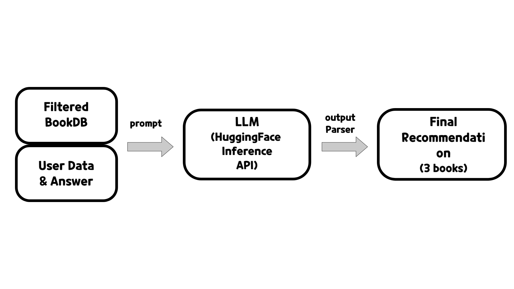

# 🛠 Twilight_AI
Twilight는 프로젝트는 사용자의 데이터에 기반하여 개인 맞춤형 책을 추천하는 서비스입니다.  
본 문서는 추천 AI 서버의 설계 및 구조를 정리한 문서입니다.

---

## 1. 개요

- AI 서버는 RAG를 활용한 추천을 제공합니다.  
  사용자가 제공된 질문에 답변을 하면 먼저 책을 필터링한 후, 해당 데이터를 기반으로 사용자에게 맞춤형 책을 추천합니다.

- RAG 사용을 위해 LangChain과 HuggingFace Inference API를 사용하였고, 백엔드 서버와 연결하기 위해 FastAPI를 기반으로 만들었습니다.

---

## 2. 데이터 처리

- AI 서버는 추천에 사용하기 위해 책 DB를 구축하였습니다. 이에 yes24의 7개 분야(경제/경영, 사회, 문학, 역사, 인문, 자기계발, 자연과학)에서 1300여권의 책 정보를 크롤링하였습니다.

- 수집된 데이터는 백엔드 서버의 DB에 SQL 형태로 저장되어 있으며, 각각의 책에는 개별 ID가 부여되어 있습니다. 아래는 책데이터의 주요 feature입니다.

    | 컬럼명       | 컬럼 ID             | 타입 및 길이        |
    | --------- | ----------------- | -------------- |
    | 테이블 ID    | `book_id`         | `bigint`       |
    | 책 이름      | `name`            | `varchar(100)` |
    | 저자        | `author`          | `varchar(100)` |
    | 소개       | `description`    | `text` |
    | 장르        | `category`        | `varchar(50)`  |
    | 쪽수        | `page_count`      | `int`          |
    | 출판사       | `publisher`       | `varchar(100)` |
    | 출판일자      | `published_at`    | `datetime`     |
    | 표지 이미지 링크 | `cover_image_url` | `varchar(255)` |


- 책 분류 및 사용자 선호 조사를 위한 질문은 자체적으로 제작하였습니다. 약 120여개의 오지선다형 질문들과 20여개의 자연어 질문을 제작하였고, 사용자는 총 5개의 질문을 거쳐 책 추천을 받게 됩니다. 

  ```sql
  -- 질문 데이터 예시

  INSERT INTO member_question (member_question_id, question, question_type, tag_id) VALUES (123, '당신의 마음이 가장 오래 머무는 순간은?', 'EMOTION', (SELECT tag_id FROM tag WHERE name = '경제/경영'));
  INSERT INTO member_question (member_question_id, question, question_type, tag_id) VALUES (124, '실패를 ‘값진 기억’이라 부를 수 있는 순간은?', 'EMOTION', (SELECT tag_id FROM tag WHERE name = '경제/경영'));
  INSERT INTO member_question (member_question_id, question, question_type, tag_id) VALUES (125, '당신은 언제 ‘부(富)’에 대한 감각이 깨어나는 것을 느끼나요?', 'EMOTION', (SELECT tag_id FROM tag WHERE name = '경제/경영'));
  INSERT INTO member_question (member_question_id, question, question_type, tag_id) VALUES (126, '당신이 ‘이건 진짜 일이다’라고 느낀 순간은 언제였나요?', 'EMOTION', (SELECT tag_id FROM tag WHERE name = '경제/경영'));
  INSERT INTO member_question (member_question_id, question, question_type, tag_id) VALUES (127, '새로운 것을 만든다는 건 당신에게 어떤 모습인가요?', 'EMOTION', (SELECT tag_id FROM tag WHERE name = '경제/경영'));

  ``` 

---
## 3. 모델
  

- 기본적으로 LangChain 라이브러리와 HuggingFace를 사용해 모델을 설계했습니다. 다만 HuggingFace에서 로컬로 모델을 로드하기에는 하드웨어적 한계가 컸기 때문에, HuggingFace Inference API를 사용하여 질문과 답변을 API로 주고 받는 형태로 구성하였습니다. 하지만 HuggingFace Inference API와 LangChain을 연결하는 건 구현이 안되어 있기 때문에 직접 wrapper를 만들어 연결했습니다.

  ```py
  # HuggingFace Inference API Wrapper

  class HFChatCompletionLLM(LLM):
    model: str
    api_key: str
    provider: str
    temperature: float
    max_tokens: int
    client: InferenceClient = Field(default=None, exclude=True)

    def __init__(self, **data):
        super().__init__(**data)
        self.client = InferenceClient(provider=self.provider, api_key=self.api_key)

    def _call(self, prompt, stop=None, run_manager=None, **kwargs):
        try:
            completion = self.client.chat.completions.create(
                model=self.model,
                messages=[{"role": "user", "content": prompt}],
                max_tokens=self.max_tokens,
                temperature=self.temperature,
            )
            if not completion.choices:
                raise ValueError("No choices returned from the completion API")
            return completion.choices[0].message["content"]
        except Exception as e:
            raise RuntimeError(f"LLM call failed: {e}")

    @property
    def _llm_type(self) -> str:
        return "hf_chat_completion_llm"
  
  ```
